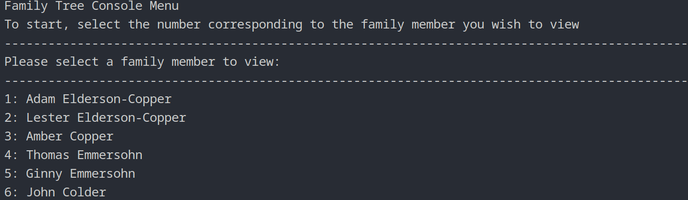

# Family Tree

Family Tree is a command line application that allows the user to view relationships of a family tree.

<!-- Add preview.png -->


## Setup

1. Clone the repo
2. to run `python main.py` (or by using your development environment), using python 3.11.0 or later
3. Follow the prompts

## Changing the family tree

The family tree is created within the CreateTree loader function, create new people, set their parents and spouses in this function. The FamilyTree class should be able to take this data and iterate over it to retrieve the relationships such as siblings, children, parents, grandparents, etc.

## Run tests

To run the tests on the core functionality within the FamilyTree class, run the following command:

```sh
python -m unittest test_FamilyTree.py
```
